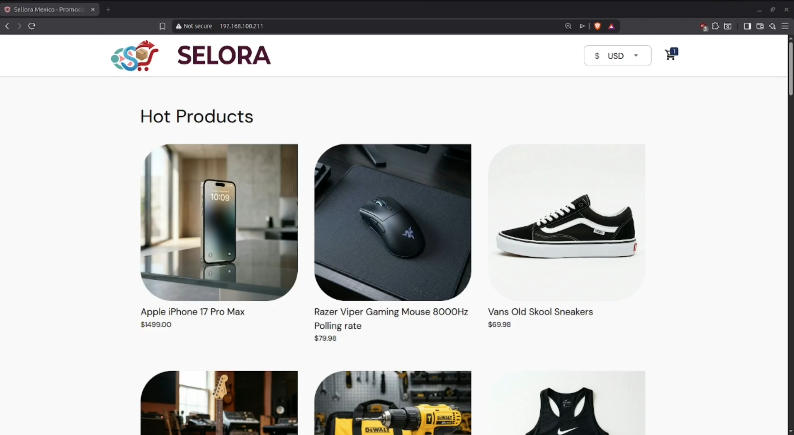
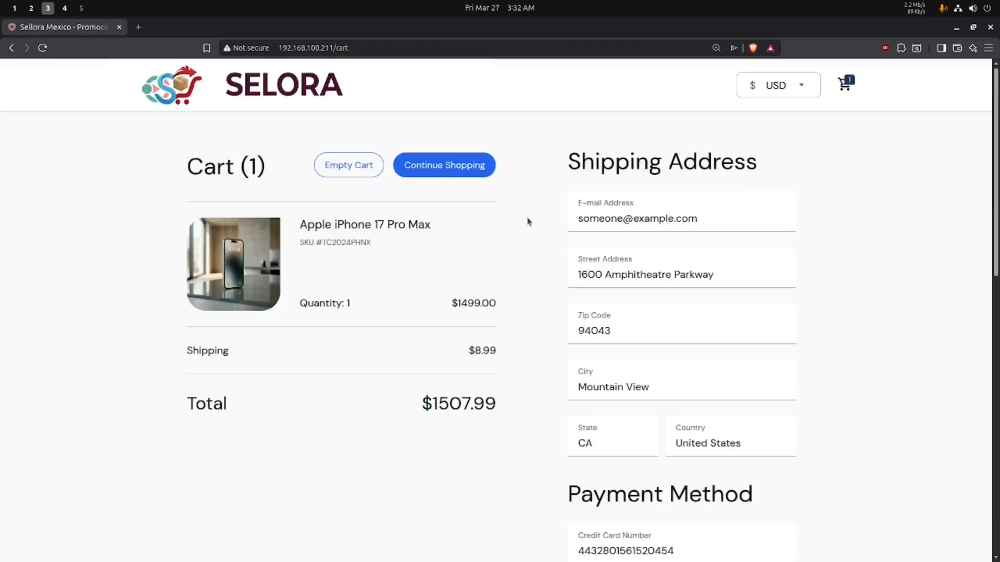
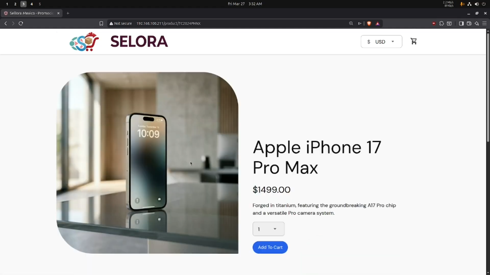

# Resilium

## Credits and attribution

This project is based on **Google's Online Boutique**, an open-source cloud-first microservices demo application licensed under the **Apache License 2.0**.

This repository contains modifications and deployment work made for an academic infrastructure project, including Kubernetes deployment, high availability testing, load balancing, ingress configuration, autoscaling and monitoring.

## Overview

**Resilium** is a cloud-first infrastructure project focused on deploying and operating a web-based e-commerce application called **Selora**, using a distributed microservices architecture.

The application allows users to browse products, add items to a cart and simulate the purchase process. It was deployed inside a Kubernetes cluster running on virtual machines running Ubuntu Server managed with Proxmox VE.

The main goal of the project is to improve application availability, automate deployment processes and enable horizontal scaling of services.

## Objectives

The project was developed with the following objectives:

- Implement a distributed architecture for a web application.
- Deploy a microservices-based e-commerce platform on Kubernetes.
- Improve service availability through replicas and failure recovery.
- Configure load balancing using MetalLB.
- Expose the application using an NGINX Ingress Controller.
- Enable horizontal autoscaling using HPA.
- Add monitoring capabilities with Prometheus and Grafana.
- Test the behavior of the system during pod and node failures.

## Architecture

The platform is composed of multiple microservices that communicate with each other through gRPC and HTTP.

The application is deployed on Kubernetes, where each microservice runs inside pods and is exposed internally through Kubernetes Services.

External access is handled through an Ingress Controller, while MetalLB provides LoadBalancer functionality in an on-premise environment.

## Technologies used

- Proxmox VE
- Ubuntu Server
- Kubernetes
- kubeadm
- containerd
- Flannel CNI
- MetalLB
- NGINX Ingress Controller
- Helm
- Istio
- cloud-init
- Metrics Server
- Horizontal Pod Autoscaler
- Prometheus
- Grafana
- Docker
- GitHub Container Registry

## Screenshots

### Main Page

  

### Checkout Screen

  

### Product Review Screen

  

